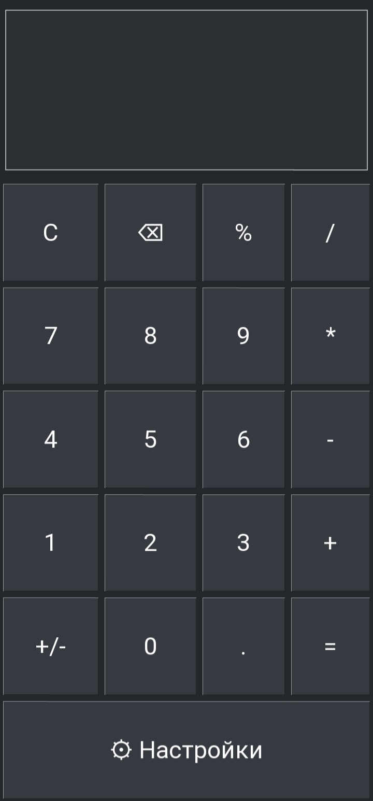
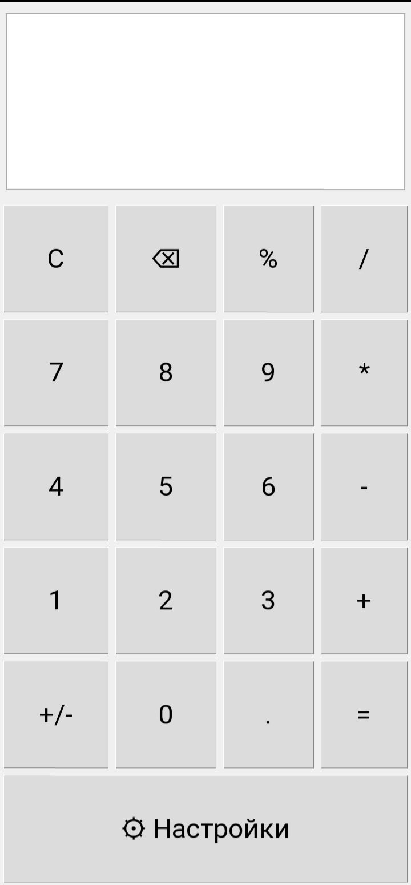
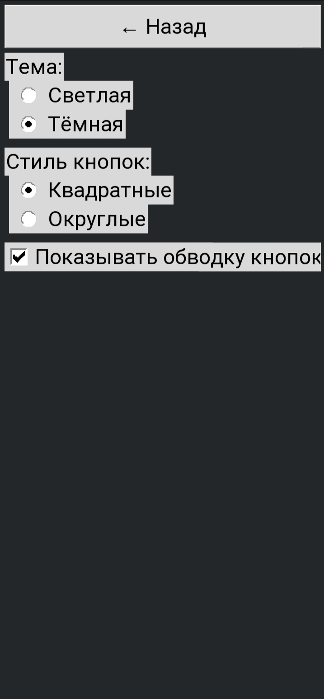

# 🧮 CalcPy

**Элегантный калькулятор на Python с поддержкой тёмной и светлой тем, кастомизации стиля кнопок и плавной анимацией!**

 

---

## 🚀 Введение

CalcPy — это современное настольное приложение-калькулятор на Python, написанное с помощью библиотеки Tkinter. Поддерживает быстрые вычисления, а также возможность переключения между светлой и тёмной темой. Каждый пользователь может выбрать стиль и оформление кнопок на свой вкус!

---

## ✨ Особенности

- Два режима оформления: 🌑 Тёмный и 🌕 Светлый  
- Переключаемый стиль кнопок: Квадратные и округлые  
- Отображение/скрытие обводки кнопок  
- Анимированный переход между калькулятором и настройками  
- Поддержка базовых операций: сложение, вычитание, умножение, деление, проценты  
- Обработка ошибок и "чистый" интерфейс  
- Минимальный дизайн и отзывчивость окна  
- Кнопка Backspace (⌫), знак смены (+/-), кнопка "C" (очистка)

---

## 🛠️ Требования

- Python 3.7+
- Tkinter (обычно входит в стандартную поставку Python)

---

## ⚡ Запуск

1. **Скачай Tkinter:**

   ```
   pkg install python-tkinter
   ```

2. **Скачай репозиторий:**

    ```
    git clone https://github.com/zyphralex/CalcPy
    cd CalcPy
    ```

3. **Запусти приложение:**

    ```
    python CalcPy.py
    ```

4. **Для запуска можно также использовать PyDroid3 и другие подобные (рекомендую)**

---

## 🎨 Кастомизация

- Перейди в «⚙ Настройки» из приложения
- Выбери свою тему и стиль кнопок  
- Включи или выключи обводку — всё на твой вкус!

---

## 💡 Скриншоты

| Тёмная тема              | Светлая тема                |
|--------------------------|----------------------------|
|  |  |
|                          | **Скриншот настроек**<br> |

---

## 👨‍💻 Как работает?

В основе — класс-наследник Tkinter `CalculatorApp` с разделением на основной экран и экран настроек.  
Минималистичная логика для вычислений, грамотная обработка ошибок и современный UI.

---

## 🤝 Контрибуции

Пулл-реквесты приветствуются, но изменения кода будут приниматься только по согласованию с автором.

---

## 📧 Связаться и фидбек

Есть предложения, баги или вопросы? Пиши в issues или на почту: supportme@rommiui.com

---

Удачных вычислений и красивых результатов с **CalcPy**! 🚀
